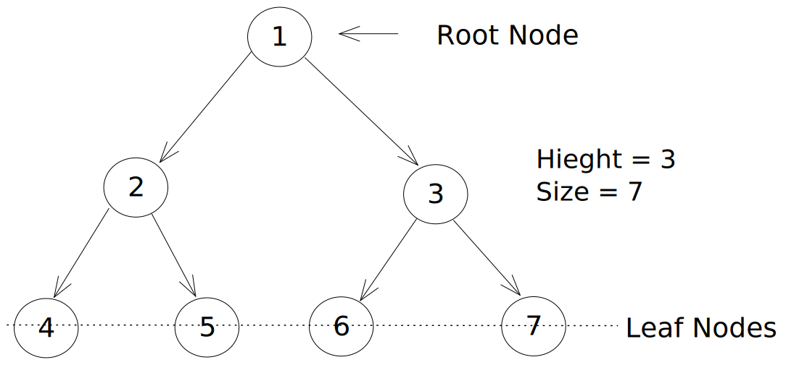
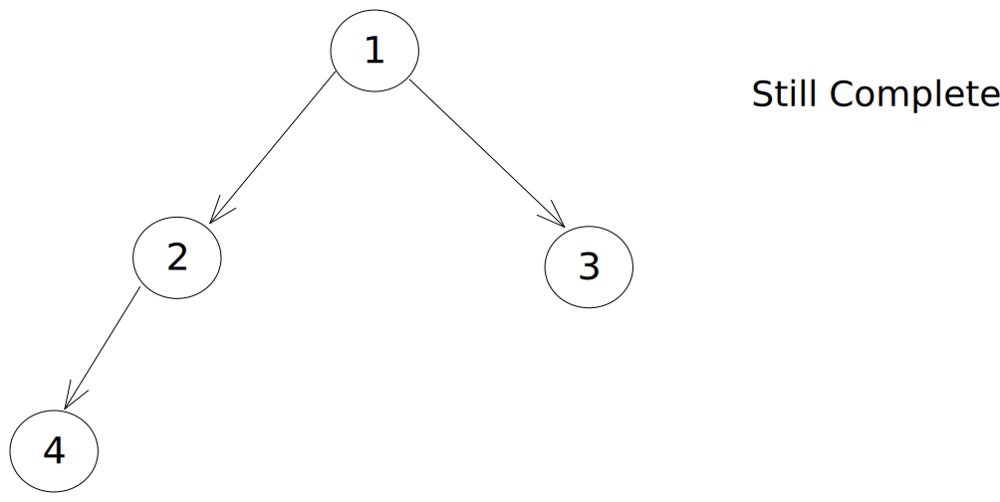
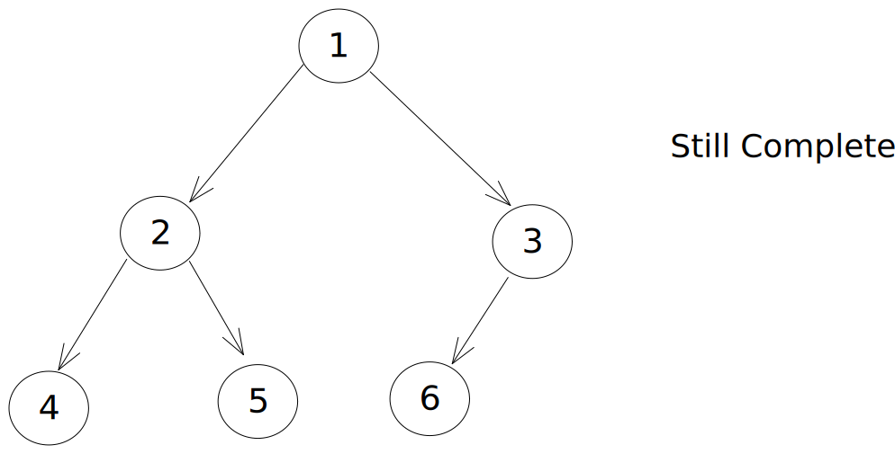
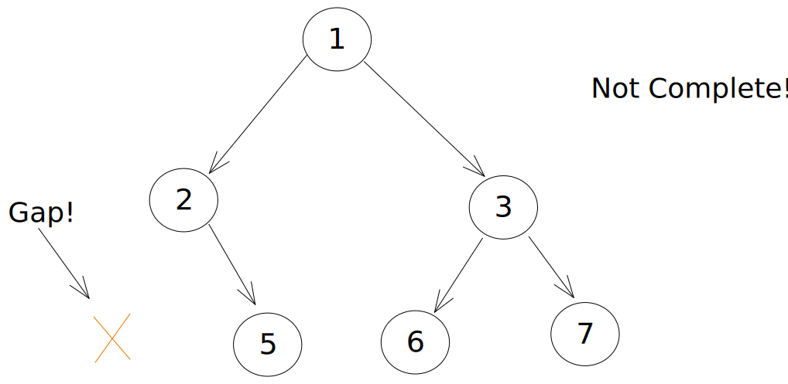
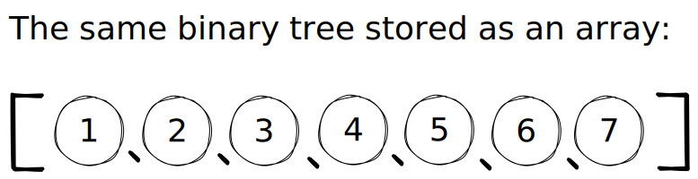

# Binary Tree Information

This document is in no way an end-all-be-all conversaion about binary trees, but it can serve as a reference to decisions made when creating the BinaryTree class in this repository.
There is still some good information in this document and is worth the read.

## What is a Binary Tree?

A binary tree is a tree structured in a way that each node has a maximum of two children.
Like with a normal tree, we like to "balance" this tree the best we can, meaning filling a "level" in the tree from left to right before moving to the next level.
What data we store in each node doesn't really matter: in our impementation we typed the value to either number or string.
But, these can be any value you can think of (even other data structures 🤯).

When a tree is filled in this manner of top-down left to right, we call it "complete," and you can see what I mean here:



This tree would still be complete if nodes 5, 6, and 7 were missing, because it would still be filled from left to right.





This tree would NOT be complete if node 4 was missing, which would create a "gap" in our left to right fill of the level.



&nbsp;

## How Do We Store A Binary Tree?

### Records and Reference

A "normal" way to store a tree is called "Record and Reference," which just means we have nodes that point to other nodes by "reference."
The node is the "record."
A node stored in a tree using a structure could look like this:

```javascript
class TreeNode {
  constructor(value) {
    this.value = value;
    this.children = [];
  }
}
```

Inside of that `children` array, you have all of the references to all the nodes underneath this one.
With a binary tree, things are even more simple:

```javascript
class TreeNode {
  constructor(value) {
    this.value = value;
    this.left = null;
    this.right = null;
  }
}
```

In this case, we only have two references to keep track of: the `left` and `right` children. Let's look at the TypeScript version:

```typescript
class TreeNode {
  value: number | string;
  right: null | TreeNode;
  left: null | TreeNode;

  constructor(value: number | string) {
    this.value = value;
    this.right = null;
    this.left = null;
  }
}
```

This is how we implement our nodes in this project.
Looking at the typing at the top of the class, our `left` and our `right` properties can either be another `TreeNode` or `null` when it doesn't point to anything.
In our implementation we also limited the value to either numbers or strings.

&nbsp;

### Implicitly Storing a Data Structure in an Array

**_This section is optional learning and can be skipped_**

We can lean on the fact that each node has only two children to store our tree another way: in an `Array`.
This might seem a little far-fetched at first, but hear me out.

Say we represent the same binary tree from above like this:



**What's important to note: I put circles around the numbers to show that this is an array of nodes, _NOT_ an array of numbers.**

We can now see that node 1 is at the 0 index, node 2 is at index 1, and so on.
What's really cool is that we can get any node's children or parent with some math.

```text
Given the index of any node:
The left child is found at (index * 2) + 1
The right child is found at (index * 2) + 2
The parent is found at the floor of (index - 1) / 2
```

So let's consider node 3 for a minute.
We know from earlier that it's parent is node 1, and it's children are node 6 and node 7.
We can find the index of each node like so:


And we can show this in code:

```javascript
// The index of node 3 is 2
const i = 2;
const node3 = binaryTree.children[index]; // Node 3 is at index 2
const parent = Math.floor((i - 1) / 2); // (2 - 1) / 2 = 0.5, which is tuncated to 0
const leftChild = i * 2 + 1; // (2 * 2) + 1 = 5
const rightChild = i * 2 + 2; // (2 * 2) + 2 = 6
```

Using this math as our rules for navigating the array, we can **_implicitly_** create a binary tree, even though the data is actually being stored in an array.
The children are implicitly the elements of the array at `2i + 1` and `2i + 2`, and the value of the element is the value of the node.
There are some tradeoffs to using this method:

- Less memory usage
- Storing new elements are as easy as `tree.children.push(newNode)`
- Lookup and traversal are pretty quick

But there is a different kind of overhead that goes into dealing with this implicit structure when compared to the "Record and Reference" method.
In our implementation we went for the R&R method, so you can ignore all of this for now.
But, this is still a great topic and we will explore it some more when we create Priority Queues.
