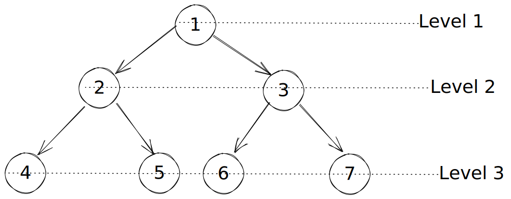

# Binary Tree Information

&nbsp;
&nbsp;

This document is in no way an end-all-be-all conversaion about binary trees, but it can serve as a reference to decisions made when creating the BinaryTree class in this repository.
There is still some good information in this document and is worth the read.

&nbsp;
&nbsp;

## Table of Contents

- [What is a Binary Tree](#what-is-a-binary-tree)
- [How Do We Store a Binary Tree](#how-do-we-store-a-binary-tree)
  - [Records and Reference](#records-and-reference)
  - [Implicitly](#implicitly-storing-a-data-structure-in-an-array)
- [Implementation](#implementation)
  - [Insert](#insert)

&nbsp;
&nbsp;

## What is a Binary Tree?

A binary tree is a tree structured in a way that each node has a maximum of two children.
Like with a normal tree, we like to "balance" this tree the best we can, meaning filling a "level" in the tree from left to right before moving to the next level.
What data we store in each node doesn't really matter: in our impementation we typed the value to either number or string.
But, these can be any value you can think of (even other data structures 🤯).

When a tree is filled in this manner of top-down left to right, we call it "complete," and you can see what I mean here:


&nbsp;
&nbsp;

This tree would still be complete if nodes 5, 6, and 7 were missing, because it would still be filled from left to right.


&nbsp;
&nbsp;

This tree would NOT be complete if node 4 was missing, which would create a "gap" in our left to right fill of the level.


&nbsp;

## How Do We Store a Binary Tree?

### Records and Reference

A "normal" way to store a tree is called "Record and Reference," which just means we have nodes that point to other nodes by "reference."
The node is the "record."
A node stored in a tree using a structure could look like this:

```javascript
class TreeNode {
  constructor(value) {
    this.value = value;
    this.children = [];
  }
}
```

&nbsp;
&nbsp;

Inside of that `children` array, you have all of the references to all the nodes underneath this one.
With a binary tree, things are even more simple:

```javascript
class TreeNode {
  constructor(value) {
    this.value = value;
    this.left = null;
    this.right = null;
  }
}
```

&nbsp;
&nbsp;

In this case, we only have two references to keep track of: the `left` and `right` children. Let's look at the TypeScript version:

```typescript
class TreeNode {
  value: number | string;
  right: null | TreeNode;
  left: null | TreeNode;

  constructor(value: number | string) {
    this.value = value;
    this.right = null;
    this.left = null;
  }
}
```

&nbsp;
&nbsp;

This is how we implement our nodes in this project.
Looking at the typing at the top of the class, our `left` and our `right` properties can either be another `TreeNode` or `null` when it doesn't point to anything.
In our implementation we also limited the value to either numbers or strings.

&nbsp;

### Implicitly Storing a Data Structure in an Array

&nbsp;
&nbsp;

**_This section is optional learning and can be skipped_**

We can lean on the fact that each node has only two children to store our tree another way: in an `Array`.
This might seem a little far-fetched at first, but hear me out.

Say we represent the same binary tree from above like this:


**What's important to note: I put circles around the numbers to show that this is an array of nodes, _NOT_ an array of numbers.**

We can now see that node 1 is at the 0 index, node 2 is at index 1, and so on.
What's really cool is that we can get any node's children or parent with some math.

```text
Given the index of any node:
The left child is found at (index * 2) + 1
The right child is found at (index * 2) + 2
The parent is found at the floor of (index - 1) / 2
```

So let's consider node 3 for a minute.
We know from earlier that it's parent is node 1, and it's children are node 6 and node 7.
We can find the index of each node like so:


And we can show this in code:

```javascript
// The index of node 3 is 2
const i = 2;
const node3 = binaryTree.children[index]; // Node 3 is at index 2
const parent = Math.floor((i - 1) / 2); // (2 - 1) / 2 = 0.5, which is tuncated to 0
const leftChild = i * 2 + 1; // (2 * 2) + 1 = 5
const rightChild = i * 2 + 2; // (2 * 2) + 2 = 6
```

Using this math as our rules for navigating the array, we can **_implicitly_** create a binary tree, even though the data is actually being stored in an array.
The children are implicitly the elements of the array at `2i + 1` and `2i + 2`, and the value of the element is the value of the node.
There are some tradeoffs to using this method:

- Less memory usage
- Storing new elements are as easy as `tree.children.push(newNode)`
- Lookup and traversal are pretty quick

But there is a different kind of overhead that goes into dealing with this implicit structure when compared to the "Record and Reference" method.
In our implementation we went with R&R, so you can ignore all of this for now.
But, this is still a great topic and we will explore it some more when we create Priority Queues.

## Implementation

As said before, we are going to be using nodes with references to other nodes as our structure.
We have already made the decision to limit the data in the nodes to either numbers or strings.
And finally, our implementation does not currently accept any arguments into it's constructor.
That leaves us with a file that looks like this:

```typescript
class TreeNode {
  value: number | string;
  right: null | TreeNode;
  left: null | TreeNode;

  constructor(value: number | string) {
    this.value = value;
    this.right = null;
    this.left = null;
  }
}

class BinaryTree {
  root: null | TreeNode;
  size: number;

  constructor() {
    this.root = null;
    this.size = 0;
  }
}
```

### Insert

The first thing we probably want to implement is adding new nodes to the binary tree.
To make this work, we need to know how to traverse a tree.
Traversal broadly boils down to Depth-First (DFS) and Breadth-First (BFS).
From there, we can break down BFS into three more types named Pre-Order, In-Order, and Post-Order traversal.
For now, we're going to focus on the Breadth-First option, which we call Level-Order traversal.
In level order traversal, we explore an entire level (usually from left and right) before we move on to the next level below.



Why do we need to know this?
Well, when we add a new node to the tree, we need to make sure we fill the first available spot.
Using level order traversal means that we can check that each level is full before moving on to the next.
If all of the levels are filled, it adds the new node to the last level in the first available spot.

We implement level order (BFS) traversal by using a queue.
We start with the root node and queue up it's children, nodes 2 and 3.
We grab the next in the queue, node 2, and queue up it's children as well.
We grab node 3, queue it's children, and so on, and so on.
The important part is that as soon as we find a missing child (set to `null`), we are done searching.
We can just add the new node there.

Now, to simplify things for our tree, we are going to assume that any deletions will "fill-in" any gaps.
We will go over what that means when we implement deleteOne and deleteAll.
For now, we just look for the first available spot at the bottom of the tree and add our new node there:

```typescript
// Insert
  insert(value: number | string) {
    // check for null
    if (value === null || typeof value === "undefined") {
      return false;
    }
    const newNode = new TreeNode(value);

    // check if Tree is empty
    if (this.size <= 0) {
      // if yes, make new node the root and return
      this.root = newNode;
      this.size = 1;
      return true;
    }

    // otherwise, place in left most bottom spot
    // Use level order traversal to find first empty node
    const queue: TreeNode[] = [];
    queue.push(this.root as TreeNode);
    while (queue.length) {
      const currentNode = queue.shift() as TreeNode;
      if (currentNode.left) {
        queue.push(currentNode.left);
      } else {
        currentNode.left = newNode;
        this.size++;
        return true;
      }

      if (currentNode.right) {
        queue.push(currentNode.right);
      } else {
        currentNode.right = newNode;
        this.size++;
        return true;
      }
    }
  }
```
